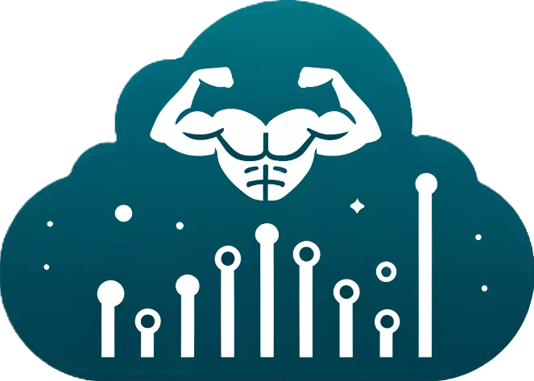

# Universal Muscle Ultrasound Repository (UMUD)



## Table of Contents
- [Project Description](#project-description)
- [Features](#features)
- [Installation](#installation)
- [Usage](#usage)
- [License](#license)
- [Contributing](#contributing)
- [Acknowledgements](#acknowledgements)

## Project Description

The Universal Muscle Ultrasound Repository (UMUD) is a Streamlit-based web application designed to provide easy access to metadata about muscle ultrasonography datasets. The app allows users to filter datasets based on various criteria, such as muscle type, image type, device, and age, and retrieve links to the relevant datasets.

## Features

- **Muscle Selection**: Filter datasets by specific muscles.
- **Image Type Selection**: Optionally filter datasets by image type.
- **Device Type Selection**: Optionally filter datasets by the device used.
- **Age Filtering**: Filter datasets based on age range.
- **Interactive Database**: Explore the database with an interactive table.
- **Challenge Section**: Propose and participate in community challenges related to muscle ultrasonography.

## Installation

To install and run this application locally, follow these steps:

1. **Clone the Repository**:
    ```bash
    git clone https://github.com/yourusername/UMUD.git
    cd UMUD
    ```

2. **Create and Activate a Virtual Environment**:
    ```bash
    python -m venv venv
    source venv/bin/activate  # On Windows use `venv\Scripts\activate`
    ```

3. **Install Dependencies**:
    ```bash
    pip install -r requirements.txt
    ```

4. **Set Up MongoDB Connection**:
    - Create a `secrets.toml` file in the `.streamlit` directory with your MongoDB connection string:
      ```toml
      [mongo]
      connection_string = "your_mongodb_connection_string"
      ```

5. **Run the Application**:
    ```bash
    streamlit run app.py
    ```

## Usage

1. **Home Tab**: Welcome page with a brief introduction to the repository.
2. **Datasets Tab**: Filter datasets by selecting the muscle, image type, device, and age. Submit the form to retrieve dataset links.
3. **Database Tab**: Explore the database through an interactive table.
4. **Challenge Tab**: Participate in community challenges by proposing new models or analysis scripts for muscle ultrasonography.

## License


## Contributing

