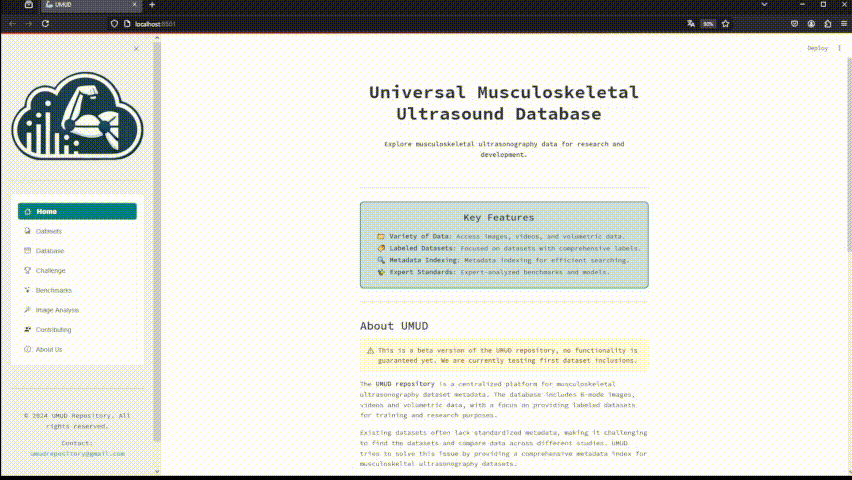

# Universal Musculoskeletal Ultrasound Repository (UMUD)


## Table of Contents
- [Project Description](#project-description)
- [Features](#features)
- [Quickview](#quickview)
- [Usage](#usage)
- [License](#license)
- [Contributing](#contributing)


## Project Description

The Universal Musculoskeletal Ultrasound Repository (UMUD) is a Streamlit-based web application designed to provide easy access to metadata about muscle ultrasonography datasets. The app allows users to filter datasets based on various criteria, such as muscle type, image type, device, and age, and retrieve links to the relevant datasets. At the moment, UMUD is more of a webapp and not a python package. 

The UMUD project is part of the [ORMIR](https://www.ormir.org/) community as a seperate [working group](https://www.ormir.org/groups.html#). 

**We are currently in the beta-testing mode. No real datasets are integrated yet!**

## Features

- 📁 **Variety of Data**: Includes images, videos, and 3DUS data.
- 🏷️ **Labeled Datasets**: Focus on datasets that include labels for better training and validation.
- 🔍 **Metadata Indexing**: Comprehensive indexing of metadata for easy search and retrieval.
- ✨ **Analysis Standards**: Provide benchmark datasets and models analysed by experts in the field.

## Quickview



## License

The UMUD repository is licensed under the **[GNU General Public License v3.0](https://www.gnu.org/licenses/gpl-3.0.en.html)**. You are free to:
- **Share**: Copy and redistribute the material in any medium or format.
- **Adapt**: Remix, transform, and build upon the material for any purpose, even commercially.

Under the following terms:
- **Attribution**: You must give appropriate credit, provide a link to the license, and indicate if changes were made. You may do so in any reasonable manner, but not in any way that suggests the licensor endorses you or your use.
- **ShareAlike**: If you remix, transform, or build upon the material, you must distribute your contributions under the same license as the original.

Each dataset is licensed on its own. Please refer to the each dataset page for more information. 


## Contributing

To contribute you can either file issues or bugs in the respective sections here on Giithub, or you can fork the repository and submit pull requests with included code changes.
To install and run this application locally, follow these steps:

1. **Clone the Repository**:
    ```bash
    git clone https://github.com/PaulRitsche/UMUD.git
    cd UMUD
    ```

2. **Create and Activate a Virtual Environment**:
    ```bash
    python -m venv venv
    source venv/bin/activate  # On Windows use `venv\Scripts\activate`
    ```

3. **Install Dependencies**:
    ```bash
    pip install -r requirements.txt
    ```

4. **Run the Application**:
    ```bash
    streamlit run app.py
    ```
Note that contributing to the database directly is not possible to ensure the quality of the included entries.
